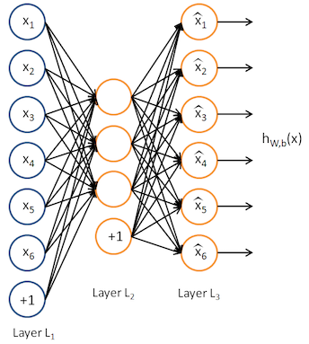

# MXNet autoencoder example for creditcard fraud detextion

Autoencoder networks are a type of unsupervised learning where the target is the input. In other words, autoencoders attempt to learn the identity function:

This might seem like a really easy task, but autoenoders attempt to make meaningful reconstructions of data by bottlenecking the system. By constraining the size of the hidden units in the network, meaningful structures of data can be discovered in a similar manner to dimensionality-reduction approaches like PCA.

Because autoencoders are creating low-dimensional representations of mostly 'normal' data, they do not necessarily need to explicitly model fraudulent/anomalous behaviour. They attempt to reconstruct data trained on 'normal' behaviour. Under the assumption that anomalous behaviour is systematically different from 'normal' data, anomalous behaviour will be evident in the reconstruction error.

We're interested in two processes: the *encoding* and *decoding* of data. These can be represented as:

If $X$ is the input and $Y$ the output, with $n$ elements:

with a mean square error loss function:

By setting a threshold on the reconstruction error (typically $1.96 \sigma$, though thresholds can be set using traditional methods such as ROC curves or precision/recall optimization), anomalous data points can be identified.

Additional information on autoencoders (in MXNet and other frameworks) can be found [here](https://github.com/apache/incubator-mxnet/tree/master/example/autoencoder), [here](https://www.oreilly.com/ideas/anomaly-detection-with-apache-mxnet), and [here](http://web.stanford.edu/class/cs294a/sparseAutoencoder_2011new.pdf).
